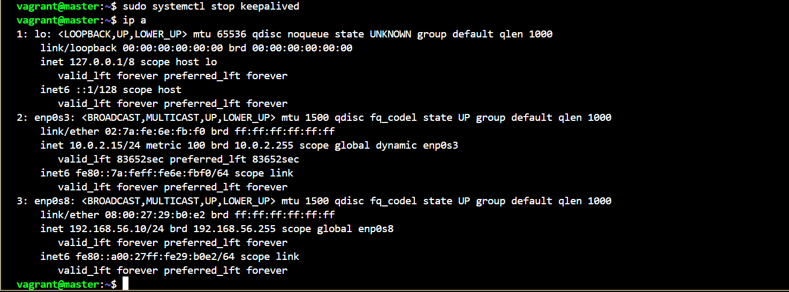
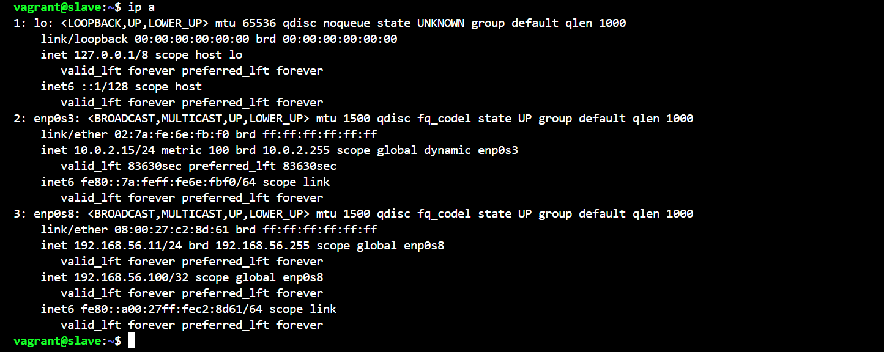

## High-availability clusters postgres
Данный плейбук производит установку отказоустойчивого кластера Postgres-14 с использованием Patroni+etcd+keepalived+haproxy в систему на базе Ubuntu 22.04.
Для создания виртуальных машин на базе virtualbox используется Vagrant.

### Установка

Протестировано на Ansible 2.17.7


1. Создание виртуальных машин:

```
vagrant up
```
Это создаст три виртуальные машины: master, slave и manager.

2. В связи с тем что vagrant у меня установлен на windows, а ansible в wsl то необходимо сначала выдать права на директорию с проектом ha_cluster (иначе ansible игнорирует файл ansible.cfg) и на приватные ключи виртуалок:

```
chmod 755 ha_cluster
chmod 600 .vagrant/machines/master/virtualbox/private_key
chmod 600 .vagrant/machines/slave/virtualbox/private_key
chmod 600 .vagrant/machines/manager/virtualbox/private_key
```

3. Запуск плейбука:

```
ansible-playbook site.yaml
```
Данный шаг выполнит автоматическую настройку всех необходимых компонентов.

### Структура проекта
```
ha_cluster/
├── README.md
├── Vagrantfile
├── ansible.cfg
├── environments/
│   └── dev/
│       ├── group_vars/
│       │   ├── all.yml
│       │   ├── etcd.yml
│       │   ├── haproxy.yml
│       │   ├── keepalived.yml
│       │   └── patroni.yml
│       └── inventory.yml
├── host
├── roles/
│   ├── etcd/
│   ├── haproxy/
│   ├── keepalived/
│   └── patroni/
└── site.yaml
```

ansible.cfg – настройки Ansible для работы с проектом. \
environments/ – директория с окружениями, в данном случае dev. \
inventory.yml – список хостов и группировка ролей. \
host - список хостов для внесения в /etc/hosts \
roles/ – директория с Ansible-ролями. \
site.yaml – основной плейбук для развертывания. \
Vagrantfile – файл конфигурации виртуальных машин.

### Проверка работоспособности

1. Проверка создания кластера, список участников и состояние:


2. Проверка статуса всех узлов в Patroni: \


3. Смена мест master/slave с помощью patronictl switchover: \


4. Конфиг haproxy на 3 порта (1 - смотрит всегда только на мастер, 2 - смотрит всегда только на слейв, 3 - балансит запросы по всем живым):


- Порт 5433 проксирует на мастер ноду.
- Порт 5434 проксирует на слэйв ноду
- Порт 5435 осуществляет балансировку.

5. Проверка состояния кластера в web ui haproxy


6. Проверка работоспособности keepalived:


7. Останавливаем службу keepalived на master что бы убедиться что virtual_ipaddress перейдет на slave:



8. Подключение к кластеру PostgreSQL через балансировщик: \


9. Подключение к кластеру PostgreSQL через master, slave: \


На slave дополнительно отправляю запрос на удаление таблицы и убеждаюсь что она работает в режиме реплики (read-only)
